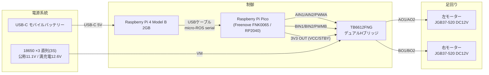

# diegobot 配線設計

自作AMR「diegobot」の電源・信号配線まとめ。実装は `edge/pico/src/production/main.hpp` のピン定義に準拠。

## 1. システム全体構成

## 2. 電源系統

| 系統 | 電源 | 供給先 | 電圧 | 備考 |
|---|---|---|---|---|
| ラズパイ系 | USB-C モバイルバッテリー | Raspberry Pi 4B (2GB) | 5V | 走行中も給電可能なモバイルバッテリーを使用 |
| モーター系 | 18650リチウムイオン電池 ×3（直列3S） | TB6612FNG の VM | 公称11.1V / 満充電12.6V | TB6612FNGのVM許容範囲(2.7〜13.5V)内 |
| ロジック系 | Pico の 3V3 OUT | TB6612FNG の VCC・STBY | 3.3V | STBYはGPIO制御せずVCCへ直結、常時イネーブル |

ラズパイ系とモーター系は電源として完全に独立しており、共通GNDはPico経由（TB6612のGNDとPicoのGNDを接続）でのみ繋がる。

## 3. Raspberry Pi 4B ⟷ Pico

- 接続: USBケーブル1本（Picoのmicro-USBポート ⟷ ラズパイのUSB-Aポート）
- 通信: micro-ROS（USBネイティブCDCシリアル、`Serial.begin(115200)`）
- Linux側デバイスパス: `/dev/ttyACM*`（reflash・抜き差しのたびに番号がずれることがあるため、`.env` の `HOST_MICRO_ROS_PORT` を都度確認）
- Picoへの給電: このUSBケーブル経由のバスパワー（別電源不要）

## 4. Pico ⟷ TB6612FNG ピン割当

`edge/pico/src/production/main.hpp` のピン定義準拠。

| 役割 | Pico GPIO | TB6612FNG |
|---|---|---|
| 左モーター PWM | GP4 | PWMA |
| 左モーター 制御1 | GP2 | AIN1 |
| 左モーター 制御2 | GP3 | AIN2 |
| 右モーター PWM | GP8 | PWMB |
| 右モーター 制御1 | GP6 | BIN1 |
| 右モーター 制御2 | GP7 | BIN2 |
| ロジック電源 | 3V3 (OUT) | VCC・STBY |
| GND | GND | GND |

PWM設定は20kHz・8bit(0-255)。RP2040は `analogWriteFreq`/`analogWriteRange` がグローバル設定のため、全チャンネル共通。

### 使用不可（予約済み）GPIO

`GP23` (SMPSモード制御) / `GP24` (VBUS検知) / `GP25` (オンボードLED) / `GP29` (VSYS電圧センスADC) はPicoボード上で専用配線されているため、モーター・エンコーダ用途では使わない。

### エンコーダ（配線はあるが本番コードでは未使用）

`one-motor`/`two-motor` の動作確認用コードのみが参照するピン。`production/main.hpp` はエンコーダ入力を読んでいない。

| 役割 | Pico GPIO |
|---|---|
| 左エンコーダ A相 | GP18 |
| 左エンコーダ B相 | GP19 |
| 右エンコーダ A相 | GP16 |
| 右エンコーダ B相 | GP17 |

## 5. モーター仕様

左右輪とも **JGB37-520 DC12V** ギアードモーター。TB6612FNGのVMは18650×3(3S)由来の公称11.1V/満充電12.6Vのため、モーター定格12Vに対しほぼ整合（フル充電直後は定格をわずかに超えるが実用上問題になりにくい範囲）。

## 6. TB6612FNG ピン配線まとめ

| ピン | 接続先 |
|---|---|
| VM | 18650×3 電池パック（+） |
| VCC | Pico 3V3 OUT |
| GND | Pico GND ・ 電池パック（−）共通 |
| STBY | VCC に直結（常時イネーブル、GPIO制御なし） |
| AIN1 / AIN2 / PWMA | Pico GP2 / GP3 / GP4 |
| BIN1 / BIN2 / PWMB | Pico GP6 / GP7 / GP8 |
| AO1 / AO2 | 左モーター |
| BO1 / BO2 | 右モーター |

## 7. 既知の制約・注意点

- STBYをVCCへ直結しているため、Pico側からドライバを無効化する手段が無い。`production/main.hpp` の `AGENT_DISCONNECTED` 時のモーター停止は、STBY遮断ではなくAIN/BIN/PWMを全てLOWにする（ショートブレーキ）方式で実現している。
- モーター用電池パックとラズパイ用USB電源は完全に別系統。GNDはPico経由でのみ共通化されるため、Pico未接続の状態でTB6612だけに通電するとロジック側が不定電位になる点に注意。
- USBシリアルのデバイスパス(`/dev/ttyACM*`)は固定されないため、Docker起動前に実機の番号を確認すること。
